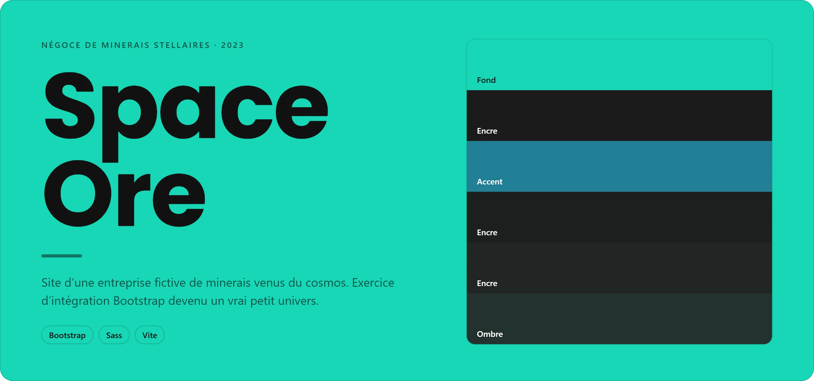
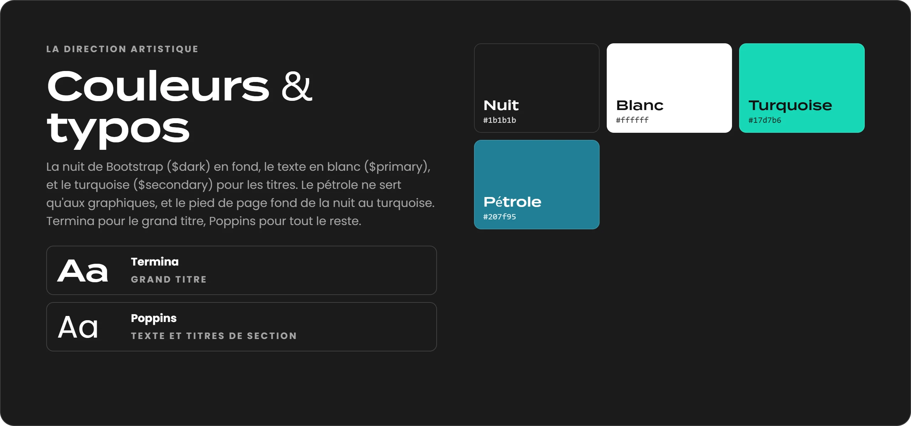

<!-- vitrine:debut — dessinée par le hub (hub/deploiement/vitrines.mjs) à partir de la fiche du projet : relancer l'outil plutôt que d'éditer ce bloc -->
<p align="center">
  
</p>

<p align="center">
  Bootstrap · Sass · Vite
</p>

## La direction artistique

<p align="center">
  
</p>

<sub>Couleurs et polices relevées dans le CSS du projet par le hub ; captures de sa fiche.</sub>
<!-- vitrine:fin -->

Discover **Space Ore** - <span style="text-decoration:underline;">Unlocking the Treasures of the Cosmos!</span>

At **Space Ore**, we are at the forefront of stellar mineral trading, bridging the world to the wonders of the universe. Our mission is to unearth the celestial riches that the cosmos has to offer and make them accessible to industries and individuals.

With a dedicated team of experts and cutting-edge technology, we venture into the far reaches of space to acquire the rarest and most precious stellar minerals. From precious stardust to exotic asteroid alloys, we bring the very essence of the cosmos to your doorstep.

What sets us apart is our unwavering commitment to sustainability and ethical sourcing. We ensure that every stellar mineral we offer is obtained responsibly, without compromising the integrity of the cosmos or the well-being of our planet.
**Space Ore** is your trusted partner for sourcing top-tier stellar minerals. Join us in this exciting adventure through the stars. 🌌🚀🪐

## <span style="color:#17D7B6;">Installation</span>

To get started with <strong>Space Ore</strong>, follow these simple steps:

1. Clone the repository:

   ```bash
   git clone https://github.com/MaximePortalier/Space-Ore.git
   ```

2. Install packages:
   ```bash
   npm install
   ```
3. Launch project:
   ```bash
   npm run dev
   ```
<br>

*Note : **Space Ore** is a school project initiated by me, Maxime Portalier, a student at My Digital School, as part of my web development training. This endeavor is a captivating and instructive adventure, carefully designed for educational purposes, inviting you to discover the beauty of the cosmos. **Space Ore** wishes you a delightful exploration and reminds you to <span style="color:#17D7B6;text-decoration:underline;">visit our store</span> to witness the vastness of the riches within our universe.*</div>